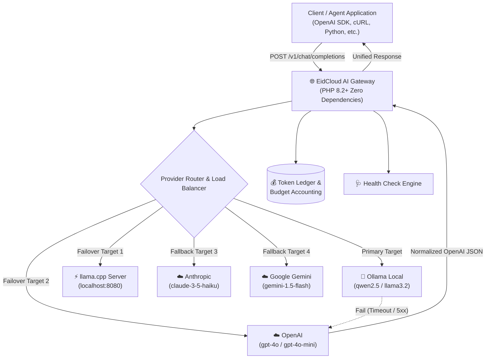

[🇸🇦 العربية](README.ar.md) | [🇬🇧 English](README.md)

# 🌐 eidcloud-ai-gateway

> Unified model-agnostic local AI gateway with automatic failover, load balancing, and token accounting in pure PHP.

[](https://github.com/shadialhasan/eidcloud-ai-gateway/releases)
[](https://php.net)
[](LICENSE)
[](https://colab.research.google.com/github/shadialhasan/eidcloud-ai-gateway/blob/main/notebooks/quickstart.ipynb)

---

## 📌 Topics
`eidcloud`, `ai-gateway`, `llm-proxy`, `ollama`, `load-balancer`, `failover`, `php8`

---

## 🚀 Overview & Architecture

**eidcloud-ai-gateway** is an ultra-lightweight, zero-dependency, model-agnostic reverse proxy and routing gateway built in pure modern PHP (8.2+). It unifies local inference daemons (**Ollama**, **llama.cpp**) and commercial AI clouds (**OpenAI**, **Anthropic Claude**, **Google Gemini**) under a standard OpenAI-compatible API interface (`/v1/chat/completions`).



---

## ✨ Key Capabilities

- **Zero External Dependencies**: 100% pure PHP 8.2+ without Composer bloat.
- **Model-Agnostic OpenAI Compatibility**: Route any client to Ollama, llama.cpp, Claude, or Gemini without changing your code.
- **Automatic Failover**: Transparently switch to cloud providers if your local Ollama or llama.cpp instance is offline or out of memory.
- **Flexible Load Balancing**: Supports sequential failover, round-robin, and weighted probability distribution.
- **Model Alias Abstraction**: Map generic model requests (e.g., `coder`, `fast`, `general`) to ordered provider cascades.
- **Token Accounting & Hard Budgeting**: In-memory and file-persisted token usage tracking with automated spend caps.
- **Streaming Support**: SSE chunk streaming simulation compatible with standard client chat UI streaming.
- **CLI & Diagnostic Suite**: Built-in CLI commands for server hosting, real-time health checks, and JSON programmatic diagnostics.

---

## 💻 Installation

Clone the repository into your environment:

```bash
git clone https://github.com/shadialhasan/eidcloud-ai-gateway.git
cd eidcloud-ai-gateway
```

No external packages required. Just ensure PHP 8.2+ is installed:
```bash
php -v
```

---

## 🛠️ CLI Usage & Quickstart

The gateway includes an executable CLI tool:

### 1. Start the Gateway Server
```bash
php bin/eidcloud-gateway serve --port=8000
```

### 2. Monitor Provider Health
```bash
# Formatted human terminal diagnostics
php bin/eidcloud-gateway check-health

# Programmatic JSON output
php bin/eidcloud-gateway check-health --json
```

### 3. Check Token Accounting & Financial Ledger
```bash
php bin/eidcloud-gateway accounting
php bin/eidcloud-gateway accounting --json
```

### 4. Inspect Model Aliases and Routing Pipelines
```bash
php bin/eidcloud-gateway routes
```

---

## 📡 API Endpoints

| Method | Endpoint | Description |
|---|---|---|
| `POST` | `/v1/chat/completions` | Standard OpenAI-compatible completion with streaming & failover |
| `GET` | `/v1/models` | List available gateway models and alias mappings |
| `GET` | `/v1/accounting` | Real-time token usage, per-provider stats, and spend totals |
| `GET` | `/health` | Live provider health checks with millisecond latency |

### cURL Example

```bash
curl http://127.0.0.1:8000/v1/chat/completions \
  -H "Content-Type: application/json" \
  -d '{
    "model": "coder",
    "messages": [
      {"role": "user", "content": "Write a clean binary search in PHP."}
    ],
    "temperature": 0.2
  }'
```

---

## 🧪 Automated Testing

Run the zero-dependency test suite:

```bash
php tests/run_tests.php
```

All 27 assertion tests verify routing, failover cascades, weighted and round-robin load distribution, token budgeting, and streaming chunk mechanics.

---

## 👤 Author & Maintainer

**Eng. MHD. Shadi AL-Hasan**  
- **Role:** Executive CTO & Enterprise Solutions Architect  
- **Email:** [mhd.shadi.alhasan@gmail.com](mailto:mhd.shadi.alhasan@gmail.com)  
- **Phone / WhatsApp:** [+963934005922](tel:+963934005922)  
- **Location:** Damascus, Syria  
- **GitHub:** [shadialhasan](https://github.com/shadialhasan)  

---

## 📄 License

This project is licensed under the MIT License - see the [LICENSE](LICENSE) file for details.  
Copyright (c) 2026 **MHD. Shadi AL-Hasan**. All rights reserved.
